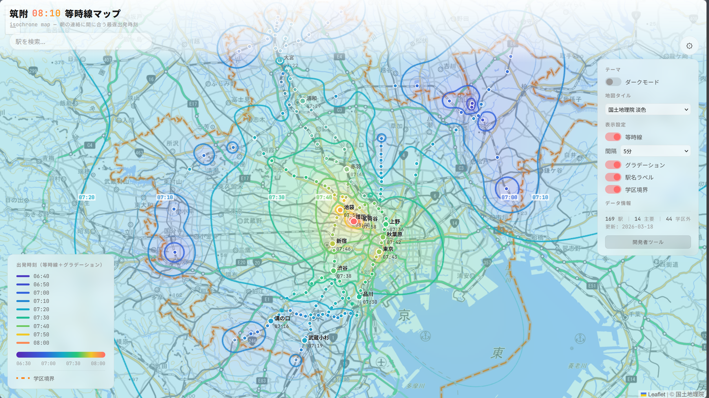
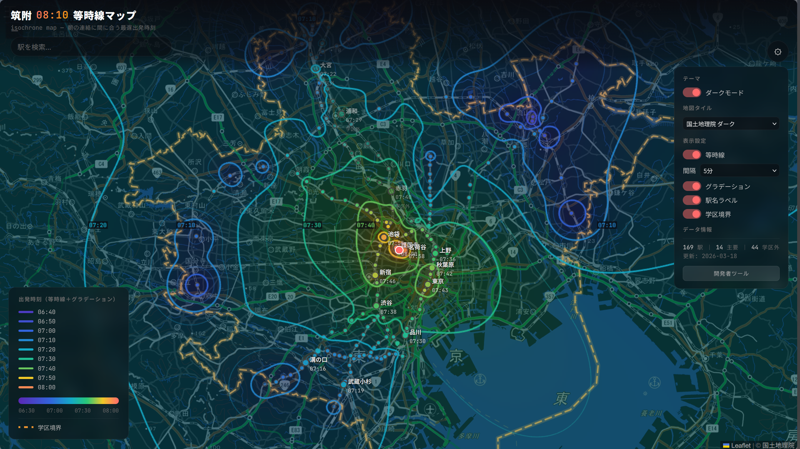

## 概要

筑駒の文化祭で鉄研が展示していたものをパクり、Webサイトとして作りました。
HTML5, CSS3, Vanilla JavaScript, Leaflet.jsなどを使用しています。

### URL

https://tsukuba-denden.github.io/isochrone-map/

### リポジトリ



### ルール
駅を追加するときは、以下のルールに従うこと。

1. 護国寺から学校までは8分、茗荷谷からは10分と公式に従うものとする。そして、階段などを考慮し筑波大学附属中学校8:08分で検索するものとする。
2. 池袋が含まれる場合は必ず有楽町線を使用するものとする。
3. 有楽町線直通のある路線(東上線および西武線)はどちらか早い物を選択するものとする 
4. 特例的に池袋副都心線乗り換えの場合のみ利用状況を鑑みて茗荷谷への丸ノ内線を採用するものとする。また、地下鉄赤塚、地下鉄成増に関しては東武線のほうが早い場合であっても有楽町線を採用する
5. Yahoo乗り換え案内の急いでモードを使用する。平日で検索すること。 
6. 駅の所在地が学区外でも学区内の家から一番近い駅が学区外の場合もあるから数駅は入れてもいい

### 学区について
【東京都】２３区、西東京市、清瀬市、狛江市、東久留米市、三鷹市、武蔵野市、府中市
調布市、小平市、東村山市、小金井市、国分寺市  
【埼玉県】和光市、川口市、朝霞市、蕨市、戸田市、志木市、新座市、さいたま市、所沢市
草加市、三郷市、八潮市  
【千葉県】浦安市、市川市、松戸市、流山市、柏市  
【神奈川県】川崎市  
[筑波大学附属中学校 令和８年度 生徒募集要項](https://www.high-s.tsukuba.ac.jp/jhs/tsukuba_j-info/wp-content/uploads/R8_%E7%94%9F%E5%BE%92%E5%8B%9F%E9%9B%86%E8%A6%81%E9%A0%85.pdf)より

### 追加方法

必要なのは
駅名,緯度,経度,到着時刻の分,路線名,ID(英語名)
任意なのは
major: 主要駅かどうか
route: 経路メモ
outside: 学区外かどうか
note: 備考
searchDate: 調査日

