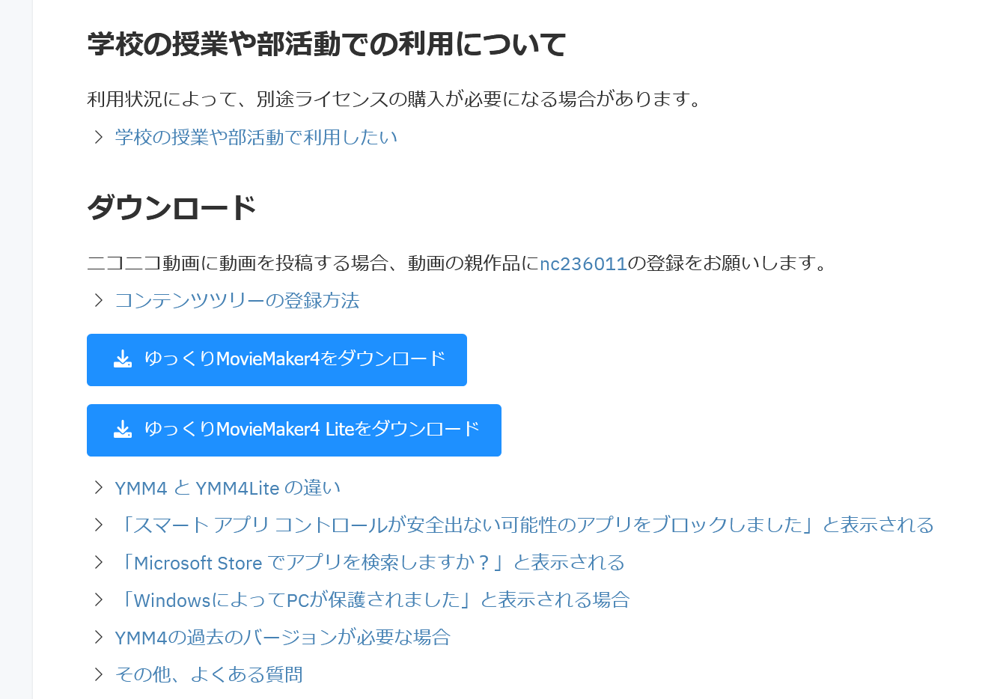
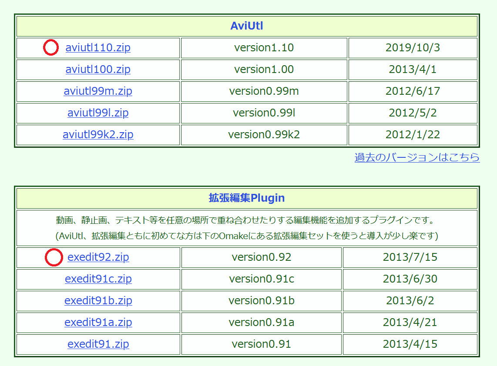

## 動画編集ソフト
電電で主に使用しているアプリケーションは次の2つ。

- [ゆっくりムービーメーカー4 (YMM4)](https://manjubox.net/ymm4/)
- [AviUtl](https://spring-fragrance.mints.ne.jp/aviutl/)

最近主流なのはYMM4。まあ好きなほうを使えばいいと思う。 
どっちも入れる手もある。 
調べるとYMM4とAviUtlのメリットデメリットについて記事書いてる人たくさんいるからそれを見て考えることをおすすめする。 <!-- その記事貼って… -->
以下は簡単にまとめたもの↓

### YMM4

#### メリット
- 一見ゆっくり動画専用と思われがちだが、動画編集ソフトとしての機能が充実 
<!-- - 画質がいい  -->
- 直感的に操作できるシンプルなデザイン
- プラグインをインストールできる
- テンプレートや画像コピペなどの機能

#### デメリット

- (Aviutlと比べれば)歴史が浅いのでネット上の情報が少ない 
<!-- - インストールがインストーラーじゃないから分かりにくい←両方同じなら書かなくていいと  -->
- AviUtlと比べるとプラグインの数は少ないかも…？

### AviUtl

#### メリット
- プラグインで機能を追加できる 
- 高度な動画も作れる 
<!-- - 画像も作れる←YMM4でもできます -->

#### デメリット
- インストールがインストーラーじゃないから分かりにくい 
<!-- - 画質がそうでもない←設定変えればFHDも読み込めたはず  -->
- 操作が複雑

## インストールの方法
勝手に調べr(ryと言いたいところだが、一応書いておく。(こっちだって記事書くの疲れたんだよ…)

### YMM4
1. サイトにアクセスする

2. 「ゆっくりMovieMaker4をダウンロード」をクリック 

ゆっくりボイスを使わないなら「ゆっくりMovieMaker4 Liteをダウンロード」でもいい


3. ダウンロードしたファイルを展開して、適当な場所に置く 

4. フォルダの中の「YukkuriMovieMaker.exe」を開く（タスクバーやスタートメニューにピン止めしておくとよい） 

公式の記事あったので載せておきます↓

### AviUtl
1. サイトにアクセスする
[AviUtl](https://spring-fragrance.mints.ne.jp/aviutl/)

2. ファイルをダウンロードする 
↓の〇がついているのを入れる

0.93rc1は絶対に入れてはいけない

3. フォルダを展開し、拡張機能のフォルダの中にあるファイルをAviUtlのフォルダの中に入れる 

4. フォルダの「AviUtl.exe」を開く（タスクバーとかにピン止めしておくとよい） 

下の記事を参照するとよいと思われる↓

### プラグイン

#### YMM4

[公式サイトのプラグイン一覧](https://manjubox.net/ymm4/faq/plugin/list/)

#### Aviutl

- [AviUtl Package Manager](https://team-apm.github.io/apm/)
AviUtl本体やプラグイン・スクリプトの導入を補助するソフトウェア。
基本的なプラグインを1クリックで入れられる。

あとは
https://note.com/takusiiman/n/nb02d82c5df61
に色々書いてある。