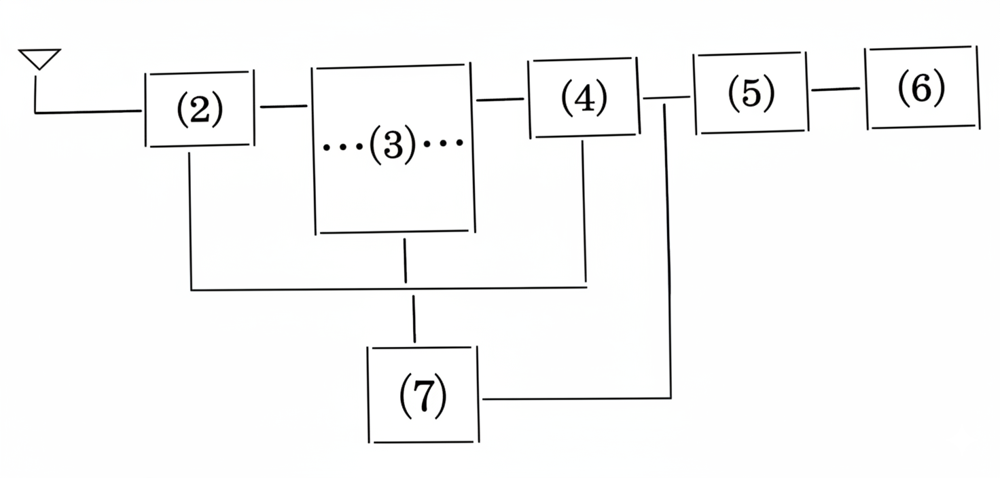

## 電波研究会

ことしの電波研究会は、高級受信機、高級再生装置ということについて研究を進めてきた。この結果がでるまでのできごとを最初に述べることにする。  
まず四月は、二・三年生による受信機、増幅器に関する理論を研究した。  
受信機の方は、通信型受信機に焦点をおいて考え、増幅器は簡単に作れることを目標にした。そのため理論も各々の特徴にあわせることにした。  
五月にはいってからは、四月に行なった理論をもとにして回路の設計をはじめた。珍らしい回路もいくつか現われたが一応つぎのようにした。  
まず受信機は七球にすることにした。受信方式は⑴スーパーヘテロダイン受信とした。⑵高周波増幅をしたあと、⑶周波数変換をし⑷中間周波増幅をし⑸検波をする。そして最後に⑹低周波増幅してスピーカーを鳴らせることにした。その間に⑺マジック・アイ・⑻Sメーターなどを入れることにした。これをブロックダイヤグラムにしてみると、

となる。  
(1) 現在最もすぐれている受信方法。  
(2) アンテナからはいった電気を大きくするところ。  
(3) 電気の波を変えてやるところ。  
(4) (3)の電気を大きくするところ。  
(5) 人の耳に聞こえるようにするところ。  
(6) (5)を大きくするところ。  
(7) ラジオについている緑に光る真空管。  
(8) 電波の強さを測る機械。  
ことばの説明に難があるが了解してほしい  
増幅器の説明は省略する。  
六月からは一年生も加わった。そこで八月までの間は基礎理論を中心に会合をひらい。それに、あたって使用した本は、 「ハムになる本」（CQ出版）・「無線工学」（オーム社）・「新ラジオ技術教科書」（日本放送出版協会）・「ラジオ部品の使い方」などである。  
九月中旬から再び、例の研究を始めた。部品表を書いて秋葉原へ行って、部品を買ってきた。  
十月からは、会全員の手で、本格的に製作をはじめた。はじめはシャーシ（アルミ製の箱）加工からはじめた。ガシャガシャと大きな音を出したため、化研のかたににも、だいぶめいわくをかけた。配線中にハンダゴテでやけどをしたり、実験中に感電する者もでやけどをしたり、製作に感涙する者もいた。そのかいもあって、製作品を学芸発表会に出品することもできた。  
その後は、予算との関係上再び理論をはじめている。  
次にこれからの電研のことについて述べてみよう。  
まず、電波研究会というからには、必ず電波について研究を進めなくてはならないかどうかである。あなたはどう思いますか？  
次に部品の問題である。ちかごろトランジスターという部品の名を耳にすることがある。それは、真空管と同じ働きをするわけだが、性質がちがうところがある。現在は真空管を主にしている。これをトランジスター化するかどうである。  
スペースが少なく、説明が不十分なところがあったようだがこのへんで終りとする。

---
図はNano Bananaで加工して作成.