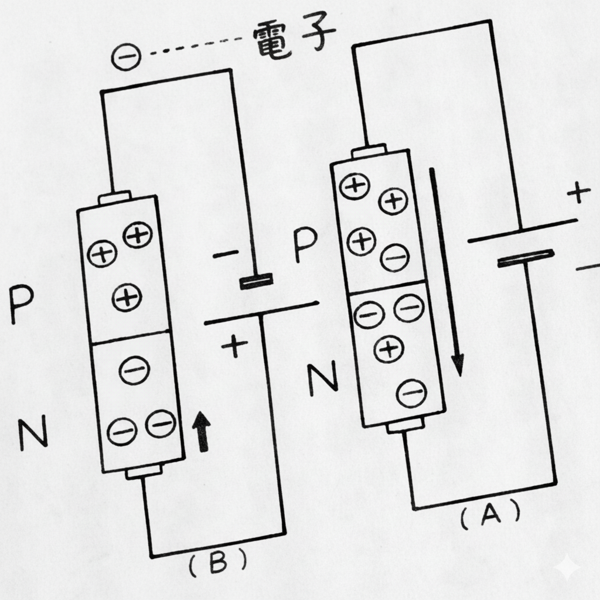
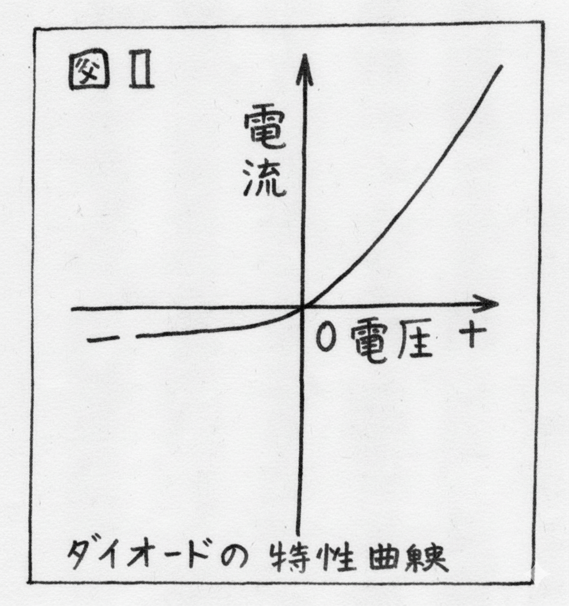
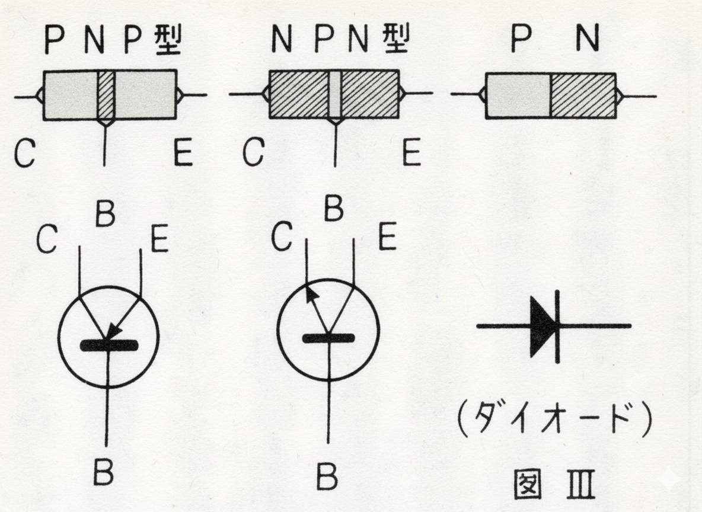
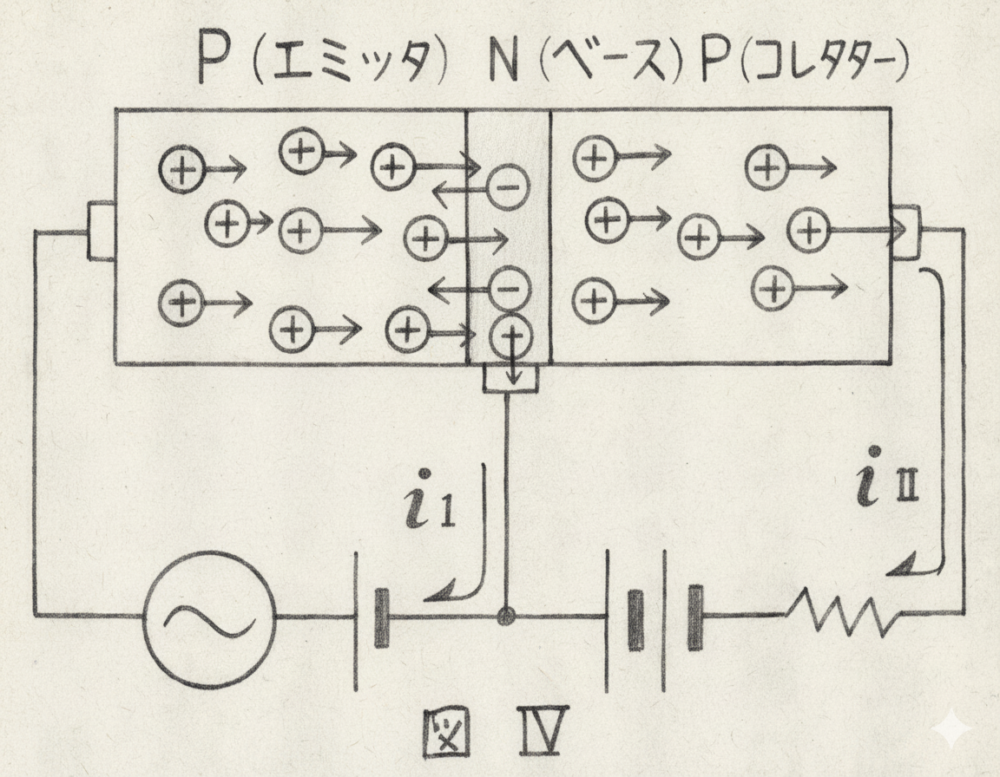

## 電波研究会

我々は「ハンダ付け研究会」ではありません。ところが、今までの電研はそちらを主としている傾向がありました。ですから高級技術はありますが、基本的なことがかえって忘れられていました。そのため、我々の言うことは、一般の人たちにとっては、ただむずかしいコトバの寄せあつめにしか聞こえないのです。学芸発表会以前は会員も熱意がなく、技術でさえ中途半端でしたが、その後は、本来の『電波研究会』にもどすのに力を注ぎました。〇〇先生にしていただいている講義などは非常に効果があるように思われます。近ごろは、だいぶ真剣に会合に出るように思われます。  
学芸発表会のためにある研究会に比べれば我々は進歩していると思っています。

### <今後の研究事項>
◎静電気○クーロンの法則○電気力線○キャパシタンスetc  

◎磁　気○クーロンの法則○磁力線etc

	
◎電磁気

	
○アンペアの右ネジの法則○フレミングの右手・左手の法則○レンツの法則○自己・相互インダクタンスetc

◎いろいろな直流回路について  
以上の他にオームの法則のようなことを講義していただきました。  
個人研究は主にトランジスターについてしました。

### <トランジスターとは>
◎わかりやすく言えば、トランジスターとは真空管のかわりのやくめをする小型のものですから、ちがう原理で動作します。  
◎P形半導体…Ge+In…電子不足の状態  
◎N形半導体…Ge+Sb…電子過剰の状態  

  
  

Aのようにすると⊕（正孔という）は矢印の方向へ動くため、電流は流れます。  
Bのようにすると正孔は動けず、電流はほとんど流れません。  
◎これをグラフに表わすと、上の図のようになります。(特性曲線という)  
◎つまり、ダイオードには電流を片方だけに流す作用（整流作用）があり、二極管のかわりをします。  
◎トランジスターは、ベースの両側にコレクターとエミッタとをつけたもので三極管のかわりをしますが、  

  
  

◎接合のしかたによってPNP型とNPN型があります。(図Ⅲ)  
◎PNP型では、図IVのような回路にすると、iⅠはわずかな電流が流れて、iⅡは電流がよく流れます。  
◎ですから、ベースに微弱な電気の変化のものを流すと、コレクターから増幅されて出てきます。これが増幅作用の原理です
正孔のあるのが特長なのです。

---

図はNano Bananaで加工して作成.