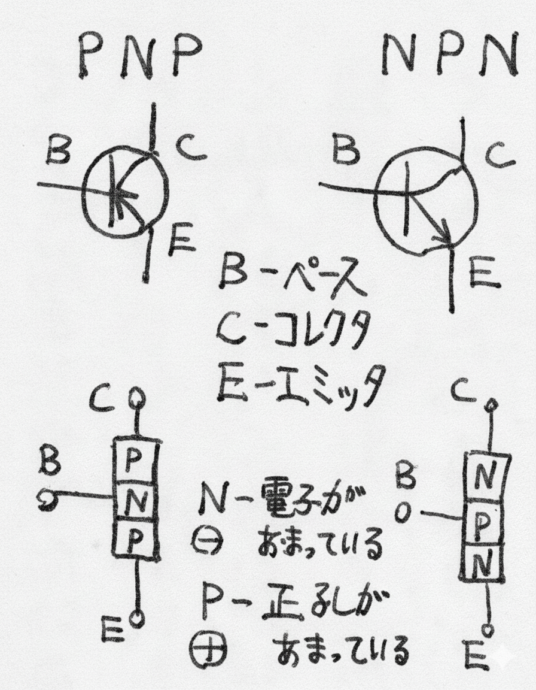

## 電波研究会

電波研究会、名称からいけば電波を研究する会ということになる。ところが電波については、まだわかっていない所が多い。つまり研究が難しいのである。だから電波そのものを研究するのは無理なので、手ごろなラジオ等を作製し、その動作を研究することから、この研究会は始まったのではないだろうか。だが現在では、電波とほとんど関係ないことをしている。電波に関係あるのは、ワイヤレスマイクくらいなもので、増幅器や低周波発振器等が大部分を占めている。さて近ごろまで電研はトランジスター全盛で、昨年度の学芸発表会でも真空管のは、ウソ発見機ただ一つだけだった。ところが、このトランジスターというのは大変な曲者で、たとえば使用するトランジスターの規格を調べ、そしてそれを基本として回路を設計する。しかし出来たのは最初予定していたようには、なかなか動作しない。これはなぜかというと、真空管では真空管中において制御が行なわれるが、トランジスターは、ゲルマニウムやシリコン、つまり物質中で行なわれるため、その物質にむらがあると、どうしても特性が異なってくる。ということで、トランジスターは研究しにくいものなのである。またテスターなどでへたに抵抗を計ると、耐圧等が低いためにこわれたり、とにかく無理がきかない。よって、トランジスターをあつかったのは製作まで。なにしろ設計どおりにいかなくて大変だった。しかし、製作の面では足が三本で、しかも小さいという利点を生かして、今まで、つまり真空管ではなかなか面倒で作られなかったようなもの、ワイヤレスマイク・低周波発振器等ができた。  
またPNPとNPN、つまり相対する二種のトランジスターによるコンプリメンタリ・シンメトリック・SEPP回路使用の増幅器は、真空管では実現不可能だったのである。いずれにしても、全体として小さくなったように思う。つまり真空管を使ったものに比べて、迫力がなくなったのである。そのかわり、いろいろの回路がたやすく作られた。  
だから、エレクトロニクスに親しみやすくなったと言えるだろう。これが特色であった。  
しかし、トランジスターが研究しにくいという面は、研究会にとって致命傷である。そのためかどうかは知らないが、最近また真空管が多く使われるようになってきた。これは最大定格を少し位オーバーしても、そう簡単には壊れないし、形態が大きいことからも、研究には向いているので、りっぱな研究をしてもらいたい。それから電研は、一般の人から離れているようだ。一般の人にも良くわかるように、研究方法を改善する必要があるように思う。最後にトランジスターについてまとめておく。基本的な構造は左図のような二種がある。図からわかるとおり、PNP型とNPN型は構造は逆になっている。PNP型はゲルマニウムから作るのが多くNPN型はシリコンから作るのが多い。次に配線を左図のようにすると、IBの変化よりもICの変化が大きい。つまり信号が増幅されたことになる。またこの信号の増幅される割合をhfeといい、トランジスタの性能を左右するものである。その他に最大定格として、最大コレクタ損失pc、最大コレクタ電流等が決められている。以上、簡単に今までをふりかえり、そして重要な位置をしめたトランジスターについて述べた。

  
  
