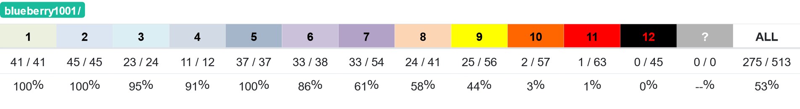
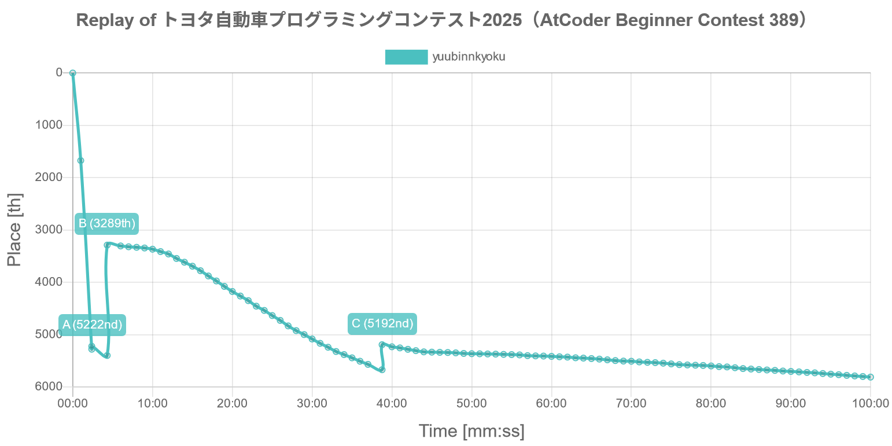
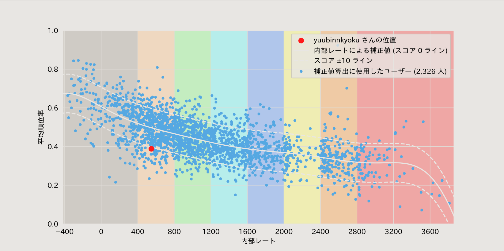
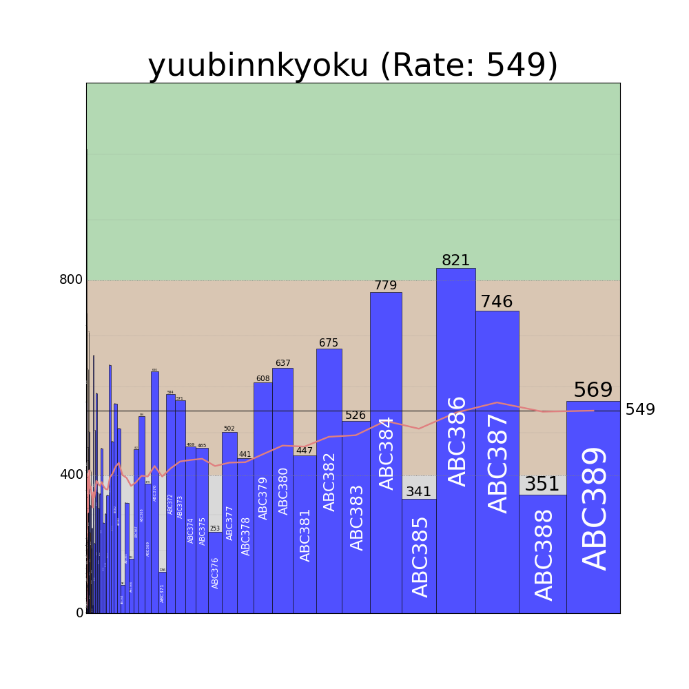

## 準備
コンテストへの参加には準備が必要。

### AtCoderアカウントをつくる
<div class="iframely-embed"><div class="iframely-responsive" style="height: 140px; padding-bottom: 0;"><a href="https://atcoder.jp/register?continue=https%3A%2F%2Fatcoder.jp%2F" data-iframely-url="//iframely.net/r4Px8rt"></a></div></div><script async src="//iframely.net/embed.js"></script>

プロフィールの「所属」は

```txt
電子電脳技術研究会
```

を含めておくと便利

### AJLに参加登録する
<div class="iframely-embed"><div class="iframely-responsive" style="height: 140px; padding-bottom: 0;"><a href="https://atcoder.jp/contests/ajl2024winter" data-iframely-url="//iframely.net/lgiLWyK"></a></div></div><script async src="//iframely.net/embed.js"></script>

学校コードは

```txt
C113110000041
```

↑コピペ用

### 拡張機能をいれる
<div class="iframely-embed"><div class="iframely-responsive" style="height: 140px; padding-bottom: 0;"><a href="https://scrapbox.io/magurofly/AtCoder%E3%82%92%E3%81%99%E3%82%8B%E3%81%A8%E3%81%8D%E3%80%81%E5%85%A5%E3%82%8C%E3%81%A6%E3%81%8A%E3%81%8F%E3%81%A8%E3%81%84%E3%81%84%E6%8B%A1%E5%BC%B5%E6%A9%9F%E8%83%BD%E3%81%AA%E3%81%A9" data-iframely-url="//iframely.net/bXIS21Y?card=small"></a></div></div><script async src="//iframely.net/embed.js"></script>
を見て好きなの入れると良い

### 環境構築する

環境構築すればローカルでコードテストができるようになります。
やらなくても良いがやるに越したことはない

## AtCoderについて
AtCoderは競技プログラミングのコンテストを主催する会社。
ABC、ARC、AGC、AHCの4種類のコンテストが存在するが、我々が参加するのはABCとAHC。

<div class="iframely-embed"><div class="iframely-responsive" style="height: 140px; padding-bottom: 0;"><a href="https://info.atcoder.jp/overview/contest/intro" data-iframely-url="//iframely.net/JOM6FWS?card=small"></a></div></div><script async src="//iframely.net/embed.js"></script>

### レートと色
AtCoderにはレートが存在する。そのレートに応じてランク分けされていて、「◯色」と表現する。

|レート|色|分布|
|---|---|---|
|0〜|<font color="#808080">灰色</font>|上位100.000%|
|400〜|<font color="#804000">茶色</font>|上位28.462%|
|800〜|<font color="#008000">緑色</font>|上位16.022%|
|1200〜|<font color="#00C0C0">水色</font>|上位7.895%|
|1600〜|<font color="#0000FF">青色</font>|上位3.609%|
|2000〜|<font color="#C0C000">黄色</font>|上位1.513%|
|2400〜|<font color="#FF8000">橙色</font>|上位0.396%|
|2800〜|<font color="#FF0000">赤色</font>|上位0.161%|

[AtCoder Info](https://info.atcoder.jp/utilize/jobs/rating-business-impact)より

ちなみに、灰〜青は寒色、黄〜赤は暖色と言われる。

### 各コンテストへの参加方法
https://atcoder.jp/homeの「予定されたコンテスト」から参加したいコンテストを探し、参加登録する。<br>
企業主催のコンテストの場合は、情報をいくつか入力しないといけない。<br>
その後、「Reted参加登録」「Unrated参加登録」の２つのボタンが表示される。<br>
前者はレート変動あり、後者はなし。具体的には疲れてる時とかはアンレを選択する。開始５分を過ぎても選択していない場合、強制的にアンレになる。

### ABC(AtCoder Beginner Contest)
レート2000までの人のレートが変動するコンテスト<br>
毎週土曜21時〜22時40分<br>
より多くの問題をより早く解けばパフォーマンスが上がる。AJL(アルゴリズム部門)のスコアにも反映される<br>
AからGまで7問あり、基本的にはA〜Cをある程度高速に解ければ茶パフォが出る。問題がムズければABだけで茶パフォ出ることも。


### AHC(AtCoder Heuristic Contest)
一風変わった形式で、1つの問題の答えをより正確に求めればパフォーマンスが上がる。AJL(ヒューリスティック部門)のスコアにも反映される
それなりにヒューステリック用の勉強をしてこないと大幅な点数改善は見込めない。ので、
- テストコードがある場合はそれをコピペ
- ない場合は空白出力
を必ず試す。(←ここ重要)


最後に提出したコードのみで判定される場合もあるので注意！


### AJL(AtCoder Junior League)
学校対抗リーグ<br>
学校ランキング/学年内の個人ランキングが存在<br>
表彰+キューブ(かっこいい)もらえるのでやった方が良い<br>
||アルゴリズム部門|ヒューリスティック部門|
|---|---|---|
|合計スコアにカウントされる数|上位6個|上位3個|
|表彰圏内|20位まで|10位まで|


## 精進
しょうじん【精進】<br>
《名・ス自》<br>
1.雑念を去り一心に仏道修行すること。<br>
2.身をきよめ行いを慎むこと。<br>
3.競技プログラミングにおいて、問題演習などを通じて実力を向上させること。

[Blueberry式初心者向けフローチャート](https://scrapbox.io/Atcoder-myReflection/%E5%88%9D%E5%BF%83%E8%80%85%E5%90%91%E3%81%91%E3%83%95%E3%83%AD%E3%83%BC%E3%83%81%E3%83%A3%E3%83%BC%E3%83%88%EF%BC%88%E6%9A%AB%E5%AE%9A%EF%BC%89)に目を通しておくと良い

ちなみにBlueberry氏は電電での競プロの流行のきっかけとなった元部員。

### AtCoder Problems
<div class="iframely-embed"><div class="iframely-responsive" style="height: 140px; padding-bottom: 0;"><a href="https://kenkoooo.com/atcoder/#/table/" data-iframely-url="//iframely.net/g8B9Svf"></a></div></div><script async src="//iframely.net/embed.js"></script>
このサイトでは、自分が解いた問題を可視化したり、ライバルと比較したり、バーチャルコンテストを立てたりすることができる。<br>
まず、自分の名前をUserIDに入力してみよう。すると、解いた問題に色がつくのが分かる。<br>
問題の左の円の部分にカーソルを合わせるとDifficultyが表示される。これは例えばDifficultyが500の場合、レート500の人の半分ぐらいがとけるあ、ということを意味する。レート500は茶色なので、この問題は「茶Diff」である。

### [AtCoder Novisteps](https://atcoder-novisteps.vercel.app/problems)
「問題一覧」から難易度別の問題に挑める。最近できたサイトで、解法別の問題もある。

### [AOJ/AtCoder-JOI](https://joi.goodbaton.com/)
情報オリンピックの過去問を検索したり自分が解いていない問題を確認したりできる。


## プログラミング言語について
アルゴリズムの勉強を始める前に、まずはどれか1つの言語で基本的な文法が使えるようになっている必要がある。それに役立つサイトなどをここでは紹介する

### どの言語を選ぶべき？
競プロでは、主にPythonとC++の2つの言語が用いられることが多い。
| 　 | Python | C++ |
| --- | --- | --- |
|速度|くっそ遅い|めっちゃ速い|
|学習コスト|低い|高い|
|コード長|短い|長い|

こんな感じで、基本的にはC++の方が競プロ向けではあるが、Pythonには簡単に学べる/書けるというメリットもある。
ということは下のどれかを選ぶことになる

- 簡単に習得できるPythonを時間制限に悩まされながらずっと使う<br>
Pythonを使っている暖色コーダーもいるにはいる
- 最初はPythonを学び、時間制限に困るようになったらC++<br>
バイリンガルになれば簡単な問題はPython/難しい問題はC++と使い分けられる(早解きに有利)
- 難しいが1度習得すればずっと使えるC++を最初から<br>
A,B問題の早解きが少し不利にはなる。

おすすめは一番下

### Pythonを学ぶ

#### APG4bPython
<div class="iframely-embed"><div class="iframely-responsive" style="height: 140px; padding-bottom: 0;"><a href="https://atcoder.jp/contests/APG4bPython" data-iframely-url="//iframely.net/r227he5"></a></div></div><script async src="//iframely.net/embed.js"></script>

AtCoder公式の教材。

#### AtCoderで始めるPython入門
<div class="iframely-embed"><div class="iframely-responsive" style="height: 140px; padding-bottom: 0;"><a href="https://qiita.com/KoyanagiHitoshi/items/3286fbc65d56dd67737c" data-iframely-url="//iframely.net/weVzQRg?card=small"></a></div></div><script async src="//iframely.net/embed.js"></script>

Pythonの基本的な構文などを学べる。これさえあればA問題は大体解ける。

### C++を学ぶ

#### APG4b
<div class="iframely-embed"><div class="iframely-responsive" style="height: 140px; padding-bottom: 0;"><a href="https://atcoder.jp/contests/APG4b" data-iframely-url="//iframely.net/g3jLqsR"></a></div></div><script async src="//iframely.net/embed.js"></script>

AtCoder公式の教材。

## その他の学習教材

### [AtCoder Beginners Selection](https://atcoder.jp/contests/abs)
ガチ初心者向けの問題が集められている。

### [競プロ典型90問](https://atcoder.jp/contests/typical90)
ABC300〜600点程度の問題が集められている。E869120さん企画。

### [AtCoder Library Practice Contest](https://atcoder.jp/contests/practice2)
C++でUnionfindなどを提供するAtCoderLibraryの練習コン。

### [EDPC / DP まとめコンテスト](https://atcoder.jp/contests/dp)
DP(動的計画法)を学びたい人におすすめ。Cまでは解けるようにしておきたい。


## 便利なサイト

### [AtCoder Clans](https://kato-hiro.github.io/AtCoderClans/)
AtCoder関連サービスを纏めたリンク集。正直ここより網羅されている。

### [AtCoder Replay (β)](https://atcoder-replay.kakira.dev/#)

こういう画像を作れる。最大瞬間風速もわかる。

### [AJL Predicter](https://kfrom40.github.io/)
AJLの成績を、コンテスト中/コンテスト直後でも確認することができる。未参加のユーザをランキング表に追加できる機能も。

### [C++メモ 関数/モジュール](https://mica-rate-b7c.notion.site/C-045096737a3441f39ded62fcdcf71f4a)
C++で知っておくべき関数などがまとめられている。

### [AtCoder Phrase Search](https://andoryoto.github.io/WebApplication/searchapp/)
過去問の解説に出てくる語句を検索できる。

### [AtCoder Companions](https://atcoder-companions.kakira.dev/)
自分の不正解コードと近いコードを検索し、正解コードとの差分を表示できる。
「何が違うのか分からん」みたいな時に便利。

### [AtCoder Type Checker](https://atcoder-type-checker.herokuapp.com/)
「多く解くタイプ」or「早く解くタイプ」を判定してくれる。


### [AtCoder Graphs β](https://atcoder-graphs.vercel.app/#contributorGraph)
各コンテストの現在のレートに対する寄与率などを表示できる。

